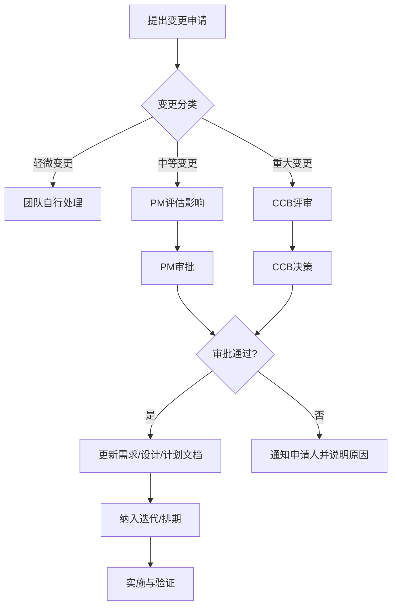

# 变更管理流程

## 1. 变更控制委员会（CCB）

| 角色 | 人员 | 权限 |
|------|------|------|
| 客户方决策人 | [待定] | 批准/拒绝重大变更 |
| 项目经理 | [待定] | 审批中等变更、评估影响 |
| 技术负责人 | [待定] | 评估技术可行性 |
| 产品负责人 | [待定] | 评估业务价值 |

## 2. 变更分类

| 类别 | 定义 | 审批路径 | 典型示例 |
|------|------|----------|----------|
| 重大变更 | 影响范围/进度/预算超过10%或涉及安全合规 | CCB审批 | 新增模块、Phase范围调整、技术架构变更、数据安全策略变更 |
| 中等变更 | 影响范围/进度/预算在5%-10%之间 | PM审批+通知客户方 | 新增非核心功能、UI布局重大调整、非核心需求变更 |
| 轻微变更 | 不影响范围/进度/预算的优化调整 | 团队自行决定，周报记录 | 文案调整、颜色/间距等UI微调、非功能性优化 |

## 3. 变更流程



## 4. 变更申请模板

```
# 变更申请

## 基本信息
- 申请人：[姓名]
- 申请日期：[日期]
- 关联需求ID：[REQ编号]
- 变更类别：[重大/中等/轻微]

## 变更描述
[清晰描述变更内容]

## 变更原因
[为什么要变更]

## 影响评估
- 范围影响：[是否影响其他模块或需求]
- 进度影响：[预计延期天数，PM填写]
- 成本影响：[预计增加/减少人天，PM填写]
- 质量影响：[是否影响验收标准]
- 风险说明：[变更引入的新风险]

## 建议方案
[推荐的处理方式]

## CCB决策（仅重大变更）
- 决策：□批准 □拒绝 □需补充信息
- 决策说明：[决策人意见]
- 决策人/日期：[姓名/日期]
```

## 5. 变更日志

| 变更编号 | 申请日期 | 变更描述 | 类别 | 申请人 | 状态 | 决策日期 | 备注 |
|----------|----------|----------|------|--------|------|----------|------|
| | | | | | | | |

---

**版本历史**
| 版本 | 日期 | 修改内容 | 修改人 |
|------|------|----------|--------|
| v0.1 | | 初稿 | |
