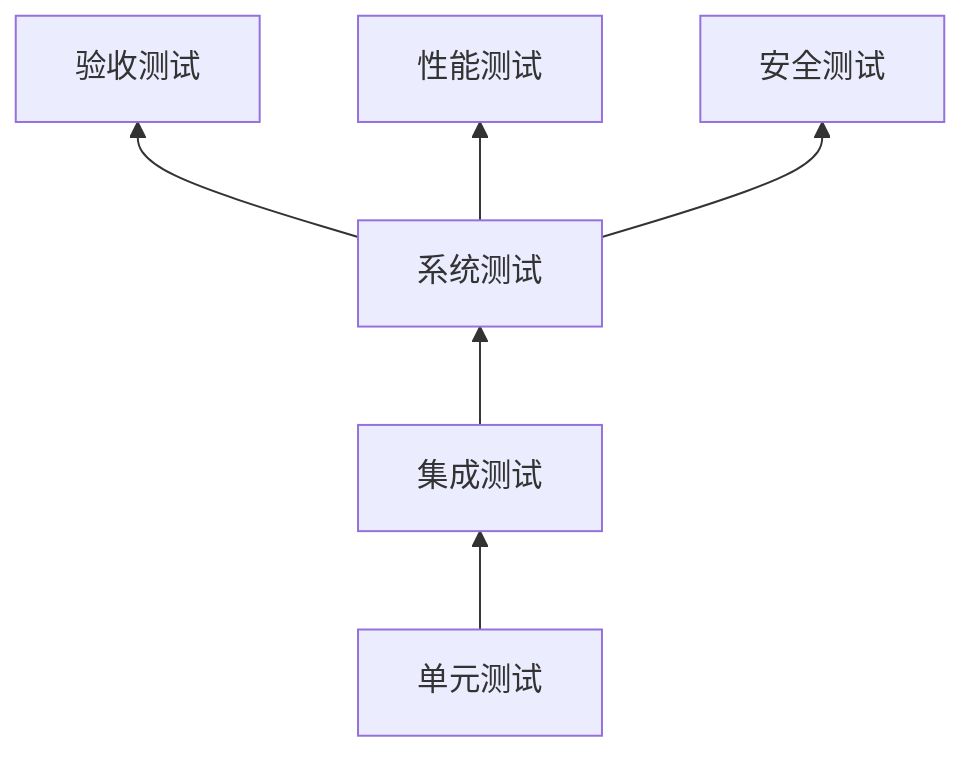

# 测试管理计划

## 1. 测试策略

本项目采用分层测试策略，覆盖从单元到验收的全链路。

| 测试层 | 目标 | 责任人 | 自动化程度 |
|--------|------|--------|------------|
| 单元测试 | 函数/方法级正确性 | 开发工程师 | 全自动（CI触发） |
| 集成测试 | 模块间交互/API契约 | 开发+测试 | 全自动（CI触发） |
| 系统测试 | 端到端业务流程 | 测试工程师 | 核心场景自动化 |
| 验收测试 | 业务需求满足度 | 客户方业务人员 | 手工+辅助 |
| 性能测试 | 响应时间/吞吐量 | 测试工程师 | 半自动化 |
| 安全测试 | 权限/脱敏/注入 | 安全工程师 | 半自动化 |

## 2. 测试范围矩阵

| 模块 | 单元测试 | 集成测试 | 系统测试 | 性能测试 | 安全测试 |
|------|----------|----------|----------|----------|----------|
| M1 DataHub | ETL逻辑、数据转换 | 数据源连接、口径计算 | 数据全链路（源→展示） | 数据量级阶梯测试 | SQL注入、数据泄露 |
| M2 IntelEngine | 采集器、分类算法 | 情报入库流程 | 情报采集→分类→推送 | 情报量级压力 | 外部数据源安全 |
| M3 KnowledgeBase | RAG检索、文档解析 | 知识库CRUD API | 知识上传→问答→引用 | 并发问答QPS | 权限越权、数据脱敏 |
| M4 BIDashboard | 指标计算、图表渲染 | 看板数据接口 | 高管旅程(D1→D2→D3→导出) | 大仪表盘并行加载 | 权限越权、导出脱敏 |
| M5 RiskGuard | 规则引擎、阈值计算 | 预警触发→推送 | 预警完整闭环 | 大量预警并发 | 预警规则篡改 |
| M6 Copilot | 意图识别、引用溯源 | Prompt→LLM→输出 | 问答→引用→反馈闭环 | AI响应延迟 | Prompt注入、数据泄露 |
| 全局 | 权限中间件 | 审计日志链路 | 跨模块全局搜索 | 全局性能基准 | 脱敏、审计、RBAC |

## 3. 测试数据管理

### 3.1 数据准备原则
- **脱敏处理**：所有测试数据必须脱敏，不包含真实客户/项目信息
- **模拟数据**：构建至少覆盖正常/边界/异常的完整模拟数据集
- **数据版本**：测试数据集与代码版本关联，可重现

### 3.2 AI评估数据集
- 构建标注的评估数据集（问答对+预期答案+引用来源）
- 每类Copilot（经营分析/情报/知识/风险）≥200条测试用例
- 意图识别评估集≥500条用户问题的标注数据
- 数据集随项目迭代持续扩充

## 4. 测试环境

| 环境 | 用途 | 数据 | 访问权限 |
|------|------|------|----------|
| 开发环境 | 开发自测 | Mock/脱敏子集 | 开发团队 |
| 测试环境 | 系统测试 | 完整脱敏数据 | 测试+开发 |
| UAT环境 | 验收测试 | 近似生产脱敏数据 | 团队+客户业务人员 |
| 生产环境 | 正式运行 | 真实数据 | 按权限 |

## 5. 缺陷管理

参照《质量管理计划》第3节的缺陷等级与流程。

## 6. 测试交付物

| 交付物 | 责任方 | 时机 |
|--------|--------|------|
| 测试计划（本文档） | 测试TL | 项目启动时 |
| 测试用例 | 测试工程师 | 每个Sprint开始前 |
| AI效果评估报告 | AI工程师 | 每个AI功能交付时 |
| 性能测试报告 | 测试工程师 | Phase结束前 |
| 安全测试报告 | 安全工程师 | Phase结束前 |
| 测试总结报告 | 测试TL | 每个Phase结束时 |
| UAT测试报告 | 客户方业务+PM | UAT结束时 |

## 7. 测试验收标准

### 7.1 进入标准（开始测试的前提）
- 代码完成并通过Code Review
- 单元测试通过率≥80%
- 测试环境部署完成
- 测试数据准备就绪

### 7.2 退出标准（测试完成的判断）
- 全部P0/P1用例通过
- 无S0/S1缺陷未关闭
- AI准确率≥预定指标
- 性能指标达标

### 7.3 暂停标准（测试中止条件）
- 阻塞性缺陷导致核心链路不可测
- 测试环境不可用超过24h
- 需求发生重大变更

---

**版本历史**
| 版本 | 日期 | 修改内容 | 修改人 |
|------|------|----------|--------|
| v0.1 | | 初稿 | |
